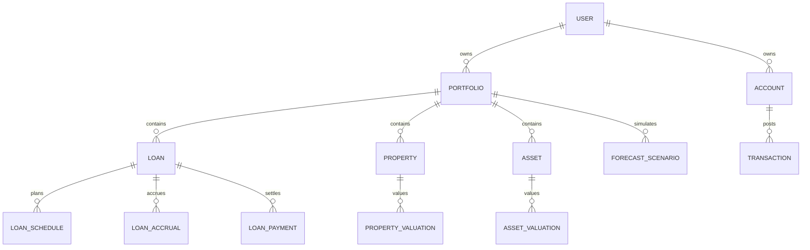

# Mô hình miền WealthOS

## Aggregate ưu tiên

`Portfolio` là aggregate trung tâm của WealthOS: một tập tài sản, nghĩa vụ nợ và định giá thuộc một user. `Transaction` là sổ cái dòng tiền hỗ trợ portfolio; `Budget` là module tùy chọn, không phải trung tâm mô hình.

| Thực thể | Trách nhiệm | Quan hệ quan trọng |
|---|---|---|
| User | Biên cách ly dữ liệu cá nhân/gia đình | Có nhiều Portfolio, Member |
| Portfolio | Danh mục theo chủ sở hữu/mục tiêu | Có nhiều Asset, Liability, Loan |
| Account | Tiền mặt, ngân hàng, thẻ | Có nhiều Transaction; là CashAsset |
| Loan | Khoản phải thu hoặc phải trả có điều khoản | Có LoanSchedule, LoanAccrual, LoanPayment |
| Property | Bất động sản theo từng tài sản | Có PropertyValuation và chi phí liên quan |
| Asset | Tài sản thủ công/khác | Có AssetValuation |
| Valuation | Ảnh chụp giá trị có ngày hiệu lực và nguồn | Thuộc Asset hoặc Property |
| Transaction | Bút toán bất biến của dòng tiền | Có thể liên kết Account, Loan, Property |
| Budget | Hạn mức chi theo kỳ | Đọc Transaction theo Category |
| ForecastScenario | Tập giả định và kết quả mô phỏng | Đọc Portfolio, schedule và dòng tiền |

## Phân loại tài sản ròng

| Nhóm | Ví dụ | Cách định giá |
|---|---|---|
| Cash & cash equivalent | Tiền mặt, ngân hàng | Số dư sổ cái đã đối soát |
| Receivable | Gốc cho vay còn phải thu | Dư gốc, có trạng thái/khả năng thu hồi |
| Property | Đất, nhà | Định giá gần nhất; lưu giá mua riêng |
| Other asset | Vàng, xe, tài sản thủ công | Định giá do người dùng nhập hoặc nguồn tích hợp |
| Liability | Vay phải trả, công nợ | Dư gốc phải trả tại ngày chốt |

## Vòng đời khoản vay

`draft` → `active` → `overdue` hoặc `closed`.

`restructured`, `written_off` và `cancelled` là các trạng thái có audit log riêng. Một khoản vay `closed` chỉ khi dư gốc và lãi phải thu theo điều khoản đều bằng 0 hoặc đã được đánh dấu xóa nợ có thẩm quyền.

## Vòng đời giao dịch

`draft` → `pending` → `posted` → `reconciled`; `voided` là trạng thái kết thúc. Điều chỉnh một giao dịch đã đối soát phải là giao dịch mới có liên kết tới bản gốc.
