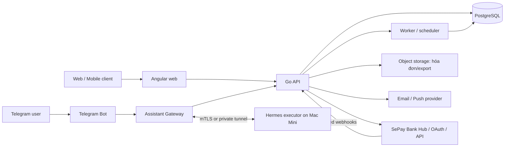

# Triển khai WealthOS

## Kiến trúc mục tiêu

## Thành phần

- **Angular:** giao diện SPA; chỉ giữ token ngắn hạn, không giữ thông tin ngân hàng nhạy cảm trong local storage.
- **Go API:** xác thực, phân quyền user, nghiệp vụ sổ cái và API đọc dashboard.
- **PostgreSQL:** dữ liệu giao dịch, audit log, cấu hình và hàng đợi công việc bền vững.
- **Worker/scheduler:** sinh giao dịch định kỳ, tính lại aggregate, tạo export và gửi nhắc lịch.
- **Object storage:** hóa đơn đính kèm và file export; dùng URL ký, mã hóa và lifecycle rõ ràng.
- **Assistant Gateway:** nhận Telegram webhook, xác thực chat, tạo command, áp policy/approval, phát kết quả và audit. Đây là module sâu; Telegram và Hermes chỉ là adapter ở hai seam.
- **Hermes executor (Mac Mini):** kết nối outbound qua mTLS hoặc private tunnel tới Gateway, nhận action schema đã được phép, thực thi bằng Hermes và gửi event. Không expose `192.168.x.x:8080` ra Internet.
- **SePay adapter:** quản lý consent kết nối ngân hàng, xác thực webhook, durable import queue và reconciliation job. Webhook không ghi thẳng ledger; token/secret được mã hóa và không đi tới client.

## Môi trường và cấu hình

| Môi trường | Mục đích | Yêu cầu |
|---|---|---|
| Local | Phát triển | Docker Compose, dữ liệu giả, secrets local |
| Staging | Kiểm thử tích hợp | Tách DB, domain riêng, dữ liệu đã ẩn danh |
| Production | Người dùng thật | Backup, giám sát, TLS, secrets manager, không dùng dữ liệu giả |

Biến cấu hình cần có: `DATABASE_URL`, `JWT_ISSUER`, `JWT_AUDIENCE`, `OBJECT_STORAGE_*`, `APP_BASE_URL`, `ENCRYPTION_KEY`, `SMTP_*`, `TELEGRAM_BOT_TOKEN`, `TELEGRAM_WEBHOOK_SECRET`, `ASSISTANT_APPROVAL_TTL`, `HERMES_EXECUTOR_CA`, `SEPAY_WEBHOOK_SECRET`, `SEPAY_CLIENT_ID`, `SEPAY_CLIENT_SECRET`, `SEPAY_API_BASE_URL` và executor credential. Không commit secrets vào repository.

## Vận hành tối thiểu

- Health check `/healthz`, readiness check kiểm tra DB và migration.
- Backup PostgreSQL hằng ngày, kiểm tra khôi phục định kỳ; mã hóa backup và giới hạn quyền truy cập.
- Migration có phiên bản, chạy trước khi rollout API tương thích; có kế hoạch rollback.
- Quan sát: error rate, độ trễ API, job trễ/lỗi, tốc độ export, chênh lệch đối soát số dư, loan accrual bị trùng/lỗi và snapshot net-worth không tái tạo được.
- Log không chứa access token, số tài khoản đầy đủ hoặc ghi chú nhạy cảm của người dùng.
- Theo dõi command queue, tỷ lệ approval/rejection, executor offline, command timeout, webhook signature failure và số external action bị policy từ chối.
- Theo dõi bank-feed queue lag, signature failure/duplicate webhook, API rate limit, stale connection, backfill gap và reconciliation difference; alert khi ingest chậm nhưng không tự tạo ledger transaction để “đuổi kịp”.

Kiến trúc sizing, queue bền vững, SLO, backup/restore và kế hoạch load test cho mốc 100 người dùng tại [18-architecture-100-users.md](18-architecture-100-users.md).

Kế hoạch triển khai chi tiết FE/BE, bank-feed và release checklist tại [development/README.md](development/README.md).
