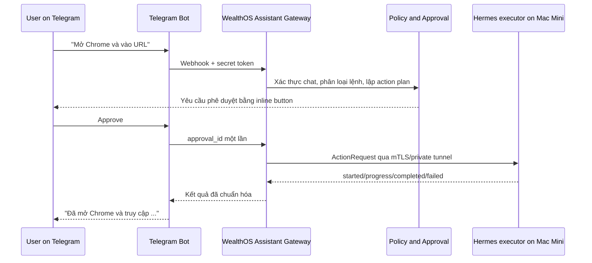
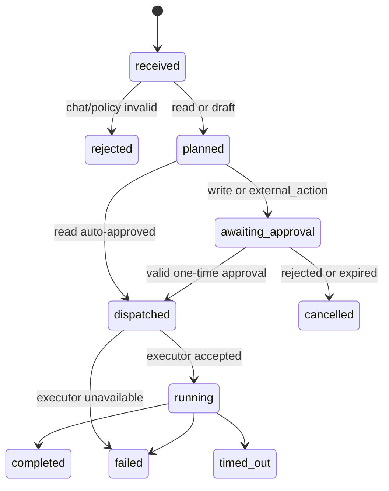

# Hermes Agent qua Telegram — WealthOS Assistant Gateway

## Mục tiêu

Cho chủ user nhắn Telegram để hỏi dữ liệu WealthOS hoặc yêu cầu Hermes Agent trên Mac Mini thực hiện một thao tác phần mềm có kiểm soát, ví dụ: “Mở Chrome và vào `https://hrm.company.vn`”. Telegram nhận/trả tin nhắn; WealthOS quyết định có cho phép không; Hermes chỉ là executor.

## Kiến trúc khuyến nghị



Không dùng tuyến `Telegram Bot → HTTP công khai trên Mac Mini`. Việc expose `http://192.168.1.100:8080/chat` chỉ phù hợp thử nghiệm cùng mạng và vẫn thiếu xác thực/approval/audit. Production dùng Hermes **kết nối outbound** tới Gateway qua mTLS, VPN/private tunnel (ví dụ Tailscale), hoặc WebSocket có credential xoay vòng.

## Module và seam

`AssistantGateway` là một module sâu có interface nhỏ:

```text
submit(actor, channel, text) -> Command
approve(actor, commandId, approvalId) -> Command
getStatus(actor, commandId) -> Command
ingestExecutorEvent(executor, event) -> Command
```

- **Telegram adapter:** verify webhook secret, map chat/user, render message và inline approval button.
- **Hermes adapter:** đăng ký executor, poll/nhận action, chuyển action schema sang Hermes API thực tế và trả event.
- **Implementation của Gateway:** intent classification, policy, authorization, idempotency, state machine, queue, timeout, audit và redaction. Những phần này không rò sang Telegram/Hermes adapter.

Khi Hermes hiện có API `POST /chat`, adapter có thể gọi endpoint này **bên trong private network**, nhưng Gateway vẫn chỉ gửi prompt/action đã chuẩn hóa. Khi Hermes đổi WebSocket hoặc CLI, chỉ adapter đổi.

## Command state machine



## Phân quyền và policy

| Loại lệnh | Ví dụ | Xử lý |
|---|---|---|
| `read` | “Tài sản ròng hiện tại?”, “Khoản nào đến hạn?” | Có thể tự chạy sau khi chat đã liên kết; trả `as-of`/data quality |
| `draft` | “Soạn kịch bản đầu tư 6 tháng” | Tạo bản nháp, không đổi dữ liệu |
| `write` | “Ghi chi 500.000 vào ăn uống” | Hiển thị bản xem trước và yêu cầu approval |
| `external_action` | “Mở Chrome và vào URL” | Allowlist action + approval + Hermes executor |
| `blocked` | “Xóa toàn bộ dữ liệu”, thao tác không có policy | Từ chối, ghi audit; không dispatch |

Executor mặc định chỉ có allowlist như `open_application`, `open_url`, `capture_status` và tool đã được admin bật. Không truyền shell command tự do, mật khẩu, OTP, private key hay token của WealthOS qua Telegram hoặc prompt của Hermes.

## Contract với Hermes executor

Gateway phát `ActionRequest` có schema, không phát text Telegram nguyên bản:

```json
{
  "commandId": "cmd_01J...",
  "correlationId": "cor_01J...",
  "type": "open_url",
  "target": { "browser": "Google Chrome", "url": "https://hrm.company.vn" },
  "expiresAt": "2026-07-17T12:05:00Z",
  "idempotencyKey": "cmd_01J...:attempt:1"
}
```

Hermes trả event `accepted`, `started`, `progress`, `completed` hoặc `failed`, gồm `commandId`, timestamp, kết quả đã redact và bằng chứng an toàn nếu phù hợp. Gateway mới là nơi quyết định trạng thái cuối và nhắn lại Telegram.

## Liên kết tài khoản và bảo mật

1. User đăng nhập WealthOS, tạo mã liên kết một lần có TTL ngắn.
2. User gửi mã đó cho bot; Gateway lưu mapping `telegram_chat_id ↔ user_id/user_id` sau khi kiểm tra mã.
3. Bot chỉ nhận update qua HTTPS webhook và secret token; bot token nằm trong secret manager.
4. Hermes đăng ký bằng credential riêng của executor, mTLS/VPN và chỉ có scope user/command được chỉ định.
5. Approval dùng inline callback chứa mã ngẫu nhiên một lần; Gateway kiểm tra actor, command, hạn dùng và trạng thái trước dispatch.
6. Audit log lưu input đã redact, policy decision, approval, executor event và kết quả. Telegram message ID/correlation ID hỗ trợ tra cứu, không thay thế audit log.

## Phản hồi Telegram

Ví dụ luồng an toàn:

```text
User: Mở Chrome và vào hrm.company.vn
Bot: Tôi sẽ mở Google Chrome trên Mac Mini và truy cập https://hrm.company.vn.
     [Phê duyệt] [Hủy]
User: [Phê duyệt]
Bot: Đang thực hiện trên Mac Mini…
Bot: Đã mở Chrome và truy cập https://hrm.company.vn. (cmd_01J…)
```

Nếu Hermes offline: “Mac Mini chưa kết nối; lệnh không được thực thi.” Không tự retry một external action sau khi hết TTL/approval.

## Lộ trình triển khai

1. **Read-only Telegram:** link account, hỏi net worth/khoản đến hạn, audit và rate limit; chưa cần Hermes.
2. **Command orchestration:** state machine, inline approval, queue, status/cancel, fake executor cho test.
3. **Hermes private executor:** adapter tới API thực tế của Hermes, mTLS/private tunnel, allowlist `open_url` trước.
4. **Write workflows:** tạo transaction/valuation qua preview + approval; không cho phép mutation trực tiếp từ agent.
5. **Mở rộng có kiểm soát:** thêm tool sau khi threat model, test permission và quan sát production đạt yêu cầu.

## Thông tin cần xác minh khi triển khai thật

- Hermes đang có interface nào: HTTP, WebSocket, CLI hay queue; có callback/progress và auth nào?
- Mac Mini có thể chạy private tunnel/VPN nào, và bot/Gateway được host ở đâu?
- Những app/site nào Hermes được phép điều khiển; có cần thao tác login/OTP không?
- Ai ngoài owner được liên kết Telegram, và lệnh nào được phép theo từng role?

Không lưu hoặc tự động điền password/OTP trong phạm vi phiên bản đầu.
