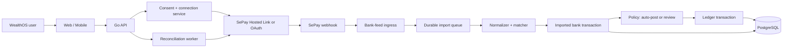

# Tích hợp SePay — bank feed và đối soát cho WealthOS

## Quyết định

SePay là integration ưu tiên đầu tiên cho thị trường Việt Nam. WealthOS dùng SePay để nhận biến động tài khoản, đối soát số dư, tự ghi nhận thu–chi theo policy minh bạch và hỗ trợ tạo yêu cầu thu tiền qua VietQR; **không** dùng SePay để tự động chuyển tiền hoặc biến WealthOS thành cổng thanh toán.

Lý do: SePay Bank Hub cung cấp Hosted Link, REST API và webhook để kết nối tài khoản, đồng bộ giao dịch/balance theo thời gian thực; đây khớp trực tiếp với mục tiêu cash flow và net-worth data quality của WealthOS. [Tổng quan Bank Hub](https://developer.sepay.vn/vi/bankhub/tong-quan). Với mô hình ứng dụng bên thứ ba, SePay cũng có OAuth 2.0 với scope đọc tài khoản/giao dịch và cơ chế revoke qua consent của người dùng. [OAuth 2.0 và scopes](https://developer.sepay.vn/vi/sepay-oauth2/tong-quan).

## Phạm vi sản phẩm

| Năng lực | Giá trị người dùng | Phiên bản đầu |
|---|---|---|
| Kết nối tài khoản ngân hàng | Không phải nhập tay toàn bộ giao dịch | Hosted Link/OAuth, consent rõ ràng, chỉ quyền đọc |
| Bank feed thời gian thực | Xem thu–chi gần thời điểm phát sinh | Webhook tạo bản ghi import bất biến, sau đó phân loại/match |
| Tự ghi chi khi tiền ra | Không phải nhập từng khoản chi ngân hàng | Tạo `expense`/`posted` sau dedupe, ngoại trừ transfer/loan/investment đã nhận diện |
| Phân tích tiền vào | Tự ghi thu nhập khi có đủ bằng chứng, không nhầm dòng tiền tài sản | Rule + matching + confidence; không chắc thì giữ review |
| Backfill và đối soát | Phát hiện webhook thất lạc hoặc account lệch số dư | Job gọi API theo cursor/khoảng thời gian; không poll thay webhook |
| Cập nhật data quality | Biết account nào đã sync, stale hoặc chưa đối soát | Hiển thị `lastSyncedAt`, trạng thái và chênh lệch |
| VietQR cho khoản thu | Gắn mã duy nhất cho kỳ thu loan hoặc payment request | QR + webhook tạo payment candidate, owner xác nhận trước khi hạch toán |

Không đưa eInvoice, SoundBox, payment gateway thẻ quốc tế hoặc Virtual Account theo đơn hàng vào MVP WealthOS. Chỉ cân nhắc VA khi một use case chủ hộ kinh doanh đã được xác nhận; nó không cần cho quản lý tài sản cá nhân.

## Hai phương án kết nối

`BankHubAdapter` là phương án chiến lược cho WealthOS nhiều người dùng: người dùng liên kết ngân hàng trong Hosted Link của SePay, còn WealthOS nhận event/API ở server. Bank Hub hỗ trợ theo từng ngân hàng và loại tài khoản khác nhau; UI phải hiển thị chính xác khả năng `in`, `out` và `balance` thay vì mặc định mọi bank đều như nhau. Ví dụ, tài liệu hiện nêu TPBank/VietinBank có thể đồng bộ tiền vào, tiền ra và số dư, trong khi một số kết nối chỉ có tiền vào. [Ma trận ngân hàng Bank Hub](https://developer.sepay.vn/vi/bankhub/tong-quan).

`SePayOAuthAdapter` chỉ dùng khi WealthOS được đăng ký là ứng dụng OAuth phù hợp và cần kết nối trên tài khoản SePay có sẵn của người dùng. Scope tối thiểu là `bank-account:read` và `transaction:read`; không yêu cầu `webhook:write` trừ khi tích hợp thực sự phải quản lý webhook qua OAuth. OAuth tránh việc WealthOS nhận thông tin đăng nhập ngân hàng của người dùng. [Scopes và authorization flow](https://developer.sepay.vn/vi/sepay-oauth2/tong-quan).

Không trộn hai adapter vào logic sổ cái. Cả hai cùng chuyển về một contract nội bộ `BankFeedProvider`.

## Kiến trúc đề xuất

Webhook chỉ là tín hiệu nhập dữ liệu, không gọi trực tiếp `POST /transactions`. Worker chuẩn hóa, chống trùng, match transfer/loan payment rồi chạy classification policy. Policy có thể auto-post một income/expense; mọi trường hợp vẫn đi qua ledger service hiện có với idempotency key, audit và khả năng reclassify.

SePay khuyến nghị dùng webhook cho giao dịch mới và API cho tra cứu/đối soát; API v2 cung cấp truy vấn giao dịch, danh sách tài khoản và môi trường sandbox riêng. [SePay API v2](https://developer.sepay.vn/vi/sepay-api/v2/gioi-thieu). Vì vậy, WealthOS dùng webhook là đường chính và reconciliation job là đường phục hồi/bổ sung, không poll liên tục.

## Luồng đồng bộ giao dịch

1. Owner chọn **Kết nối ngân hàng**, đọc phạm vi dữ liệu, thời gian backfill và xác nhận consent.
2. WealthOS mở Hosted Link hoặc bắt đầu OAuth authorization; callback được ràng buộc state/PKCE và user hiện tại.
3. Server lưu connection/tokens đã mã hóa, tạo `account` WealthOS có `provider = sepay` và mapping external account. Không lưu mật khẩu ngân hàng.
4. SePay gửi webhook về endpoint riêng. Ingress xác thực, lưu raw event và trả phản hồi thành công nhanh; xử lý sau đó chạy trong durable queue.
5. Normalizer tạo `bank_feed_transactions` bất biến. Matcher tìm transfer nội bộ, payment code loan và rule người dùng trước khi chạy income/expense classifier.
6. Nếu event là `out`, WealthOS tự ghi `expense`/`posted` theo category rule hoặc `Uncategorized` mặc định, trừ ngoại lệ nghiệp vụ được nhận diện chắc chắn. Nếu event là `in`, WealthOS tự ghi `income`/`posted` chỉ khi classifier đạt ngưỡng confidence; còn lại là `pending_review`.
7. Người dùng có thể duyệt, chỉnh mapping hoặc bỏ qua; mọi auto-post/cập nhật thủ công đều qua ledger service với idempotency key liên kết event nguồn.
8. Reconciliation job định kỳ backfill API, kiểm tra missing range, trạng thái webhook và số dư nếu provider/bank có hỗ trợ.

Với webhook SePay thông thường, event có `id` ổn định khi retry/replay, `transferType` là `in`/`out`, amount VND là số nguyên dương và `accumulated` có thể là `0` khi bank không trả số dư. SePay yêu cầu phản hồi `200` hoặc `201` với JSON `{"success": true}` trong 30 giây. [Contract webhook](https://developer.sepay.vn/vi/sepay-webhooks/tich-hop-webhook). Vì vậy `accumulated = 0` phải được biểu diễn là **không có số dư**, không phải số dư bằng không.

## Hợp đồng dữ liệu và chống trùng

### Bảng bổ sung

| Bảng | Vai trò | Ràng buộc chính |
|---|---|---|
| `bank_connections` | Consent, provider, external connection/account, trạng thái và thời điểm sync | `user_id`, token mã hóa; chỉ owner quản lý/revoke |
| `bank_feed_events` | Raw event đã nhận, chữ ký/trạng thái xử lý và payload đã redacted | unique `(provider, external_event_id)` |
| `bank_feed_transactions` | Bản chuẩn hóa bất biến của giao dịch ngân hàng | unique `(connection_id, provider_transaction_id)`; lưu classification, confidence, evidence, posting state và ledger link |
| `bank_automation_rules` | Rule do người dùng xác nhận để phân loại bank feed | priority, scope, điều kiện, action, version và trạng thái enabled |
| `bank_reconciliations` | Kết quả đối soát theo account/as-of | chênh lệch, nguồn số dư, trạng thái và actor giải quyết |
| `payment_requests` | VietQR request cho kỳ thu xác định | unique `payment_code`, expiry, expected amount, trạng thái |

Khóa idempotency có scope provider: không dùng `SePay id` đơn lẻ trên toàn hệ thống. Event retry/replay phải trả thành công nhưng không tạo thêm candidate hay transaction. Đây là yêu cầu đặc biệt quan trọng vì SePay nói rõ webhook có thể retry, được replay thủ công, hoặc nhiều webhook cùng trỏ vào một endpoint; tài liệu khuyến nghị khóa unique theo transaction id. [Chống trùng webhook](https://developer.sepay.vn/vi/sepay-webhooks/tich-hop-webhook).

Raw payload cần retention hữu hạn và redact `accountNumber`, `content`, `description`; các trường này có thể chứa dữ liệu cá nhân. Chỉ các quyền cần thiết mới xem được bản đầy đủ phục vụ đối soát.

## Tự ghi chi và phân tích tiền vào

### Thứ tự quyết định bắt buộc

Classifier không được kết luận `income`/`expense` từ chiều tiền một cách mù quáng. Mỗi bank event đi qua thứ tự sau; một bước match thì các bước dưới không chạy:

1. Xác thực, chống trùng và kiểm tra reversal/correction.
2. Match transfer nội bộ giữa các account cùng user.
3. Match payment code loan/VietQR; tạo `payment_candidate`, không tự chia gốc–lãi.
4. Match rule nghiệp vụ rõ ràng: `loan_disbursement` hoặc `investment_funding`.
5. Với `out`: tự ghi `expense`/`posted`.
6. Với `in`: phân tích evidence; tự ghi `income`/`posted` nếu đủ confidence, nếu không tạo `pending_review`.

### Tiền chuyển đi

Người dùng bật tính năng này theo account hoặc user. Mọi event `out` hợp lệ sẽ tạo chi tiêu tự động, có category từ rule ưu tiên cao nhất hoặc `Uncategorized` nếu chưa có rule. Mục tiêu là ghi nhận chi ngay, không chờ người dùng mở app.

Ngoại lệ ở bước 2–4 vẫn bắt buộc: chuyển giữa tài khoản của chính người dùng là `transfer`, giải ngân khoản vay là `loan_disbursement`, và nộp vốn đầu tư là `investment_funding`. Ghi chúng thành chi tiêu sẽ làm sai budget, income/expense report và attribution net worth. Nếu hệ thống không có bằng chứng cho ngoại lệ, nó làm đúng yêu cầu mặc định: auto-post `expense`, kèm nhãn `auto_classified` để người dùng sửa lại sau.

### Tiền chuyển vào

`in` không đồng nghĩa thu nhập: có thể là chuyển nội bộ, thu gốc khoản vay, hoàn tiền, vay mới hoặc bán tài sản. WealthOS chỉ auto-post `income` khi có ít nhất một evidence mạnh, hoặc tổng điểm đạt ngưỡng user cấu hình.

| Evidence | Ví dụ | Điểm gợi ý |
|---|---|---:|
| Rule người dùng chính xác | Nội dung/payer khớp “LƯƠNG CÔNG TY A” → Salary | 100 |
| Mẫu lặp đã được người dùng xác nhận | Cùng đối tác, khoảng ngày và amount gần các tháng trước | 70 |
| Từ khóa/nhãn user-defined | `luong`, `thu nhap`, `hoa hong`, `freelance` | 45 |
| Có payment code loan/VietQR | Kỳ thu loan xác định | Chặn income; tạo payment candidate |
| Có cặp transfer nội bộ | Tiền về account khác trong user | Chặn income; tạo transfer |
| Không có bằng chứng đủ mạnh | Nội dung tự do, người gửi lạ | 0; giữ review |

Ngưỡng mặc định là 70. AI/NLP, nếu được bật sau này, chỉ được thêm evidence đề xuất và không được tự nâng một giao dịch lên `income` nếu không có rule/mẫu người dùng đã xác nhận. Mọi evidence, version classifier và confidence phải hiển thị ở giao dịch để người dùng hiểu vì sao hệ thống đã ghi thu.

### Ma trận hành vi

| Tình huống bank feed | Hành vi mặc định |
|---|---|
| `out` không có ngoại lệ | Tự tạo `expense`, `posted`, category theo rule hoặc `Uncategorized` |
| `out`/`in` có cặp nội bộ | Tạo/đề xuất `transfer`, không tạo expense/income |
| `in` khớp payment code của loan | Tạo `payment_candidate`; owner duyệt payment split |
| `in` đạt confidence income | Tự tạo `income`, `posted`, kèm evidence/confidence |
| `in` chưa đạt confidence | `pending_review`; user chọn income, transfer, loan payment, asset sale, ignore hoặc split |
| Amount đúng nhưng payment code loan không khớp | Không tự gán loan hoặc income; cần review |
| Webhook đến muộn/replay | Không tạo lại import, candidate hoặc ledger entry |

### Rule và chỉnh sửa

`bank_automation_rules` được đánh giá theo priority và scope account trước scope user. Rule có điều kiện bằng provider, direction, account, amount range, content/reference pattern, counterparty label hoặc lịch lặp; action là category/type cụ thể. Không dùng rule toàn cục “mọi tiền vào là income”.

User có thể reclassify giao dịch tự ghi. Hệ thống giữ raw import, tạo adjustment/audit và có thể hỏi người dùng “áp dụng cho các lần sau?” để tạo rule mới. Sửa một giao dịch không tự động sửa lịch sử hoặc các giao dịch khác.

## VietQR cho kỳ thu loan

WealthOS có thể tạo `payment_request` cho một loan schedule: amount dự kiến, mã `WOS-{requestId}` ngắn, expiry và QR chuyển khoản đến account đã chọn. Khi SePay webhook trả `code`/`content`, WealthOS chỉ match một payment request còn hiệu lực theo mã; owner thấy candidate trước khi loan payment được ghi.

SePay hỗ trợ tạo QR VietQR động với account, amount và nội dung chuyển khoản; webhook payload có trường `code` được trích từ nội dung khi có cấu hình mã thanh toán. [Tạo QR VietQR](https://developer.sepay.vn/vi/tien-ich-khac/tao-qr-code) và [payload webhook](https://developer.sepay.vn/vi/sepay-webhooks/tich-hop-webhook). Đây là **yêu cầu thu**, không phải lệnh thanh toán; WealthOS không giữ quyền chuyển tiền hoặc dùng API để chi hộ người dùng.

## API WealthOS bổ sung

| Method | Đường dẫn | Mục đích |
|---|---|---|
| `POST` | `/integrations/sepay/connect` | Tạo Hosted Link hoặc OAuth authorization, yêu cầu scope đọc tối thiểu |
| `GET` | `/integrations/sepay/callback` | Xác minh state/PKCE, hoàn tất liên kết server-side |
| `GET` | `/bank-connections` | Xem connection, phạm vi dữ liệu, last sync, health và consent |
| `POST` | `/bank-connections/{id}/sync` | Yêu cầu backfill/đối soát có rate limit; không dùng cho polling UI |
| `POST` | `/bank-connections/{id}/revoke` | Thu hồi consent, vô hiệu token/webhook và ghi audit |
| `POST` | `/webhooks/sepay` | Endpoint provider-only: verify signature, dedupe, enqueue rồi trả success |
| `GET` | `/bank-feed-transactions` | Danh sách candidates/imports, lọc trạng thái/account/khoảng thời gian |
| `POST` | `/bank-feed-transactions/{id}/approve` | Tạo ledger transaction/transfer/loan payment từ candidate, idempotent |
| `POST` | `/bank-feed-transactions/{id}/reclassify` | Sửa type/category của import hoặc transaction tự ghi, tạo adjustment/audit |
| `POST` | `/bank-feed-transactions/{id}/ignore` | Bỏ qua có lý do; giữ audit và event nguồn |
| `GET, POST` | `/bank-automation-rules` | Xem/tạo rule nhận diện tiền vào và phân loại chi tự động |
| `POST` | `/bank-automation-rules/preview` | Chạy rule chưa lưu trên imported transaction mẫu; không ghi dữ liệu |
| `PATCH, DELETE` | `/bank-automation-rules/{id}` | Bật/tắt/sửa rule; không sửa giao dịch lịch sử |
| `POST` | `/loans/{id}/payment-requests` | Tạo VietQR payment request cho một kỳ thu |

Endpoint callback/webhook không được suy user từ URL do client gửi. Server phải đối chiếu state/connection/provider identity với owner và user đã lưu.

## Bảo mật và vận hành

- Dùng HMAC-SHA256 trên raw body cùng timestamp của SePay; từ chối timestamp quá hạn và xác thực bằng compare constant-time. Đây là mẫu xác thực được SePay công bố cho webhook. [Mẫu xác thực webhook](https://developer.sepay.vn/vi/sepay-webhooks/lap-trinh-webhook).
- Bật HTTPS, allowlist IP nếu SePay cung cấp IP chính thức cho môi trường đang dùng, rate limit và WAF; IP không thay thế xác thực chữ ký.
- Token OAuth/refresh token và provider secret nằm trong secret manager hoặc encrypted column với envelope encryption; không nằm ở client, log hay attachment.
- Acknowledge event sau khi durable insert/enqueue, không chờ matching hoặc rebuild snapshot trong request 30 giây.
- Theo dõi `webhook_signature_failure`, duplicate ratio, queue lag, API 401/429, backfill gap, stale connection, reconciliation difference và tỷ lệ candidate được duyệt/bỏ qua.
- Dùng Test mode/Sandbox cho CI và staging. SePay mô tả môi trường test tách biệt hoàn toàn dữ liệu live, gồm webhook/API Access/giao dịch mô phỏng. [Test mode](https://developer.sepay.vn/vi/tien-ich-khac/test-mode).

## Tiêu chí hoàn thành MVP

1. Kết nối/revoke account không làm lộ bank credential hay token.
2. Một event retry/replay không thể tạo hơn một imported transaction hoặc một ledger transaction.
3. Webhook hợp lệ được ack trong thời hạn SePay yêu cầu; classifier/matcher lỗi không làm mất event.
4. `out` không có ngoại lệ được auto-post chính xác thành expense một lần; transfer/loan/investment đã match không bị ghi thành expense.
5. `in` chỉ auto-post income khi đạt confidence; loan payment/transfer và tiền vào mơ hồ không bị ghi nhầm là income.
6. Người dùng phân biệt được imported, auto-posted, candidate đã match, pending review và ignored; xem được evidence/confidence.
7. Số dư provider thiếu/không hỗ trợ được hiển thị là `unavailable`, không hiển thị `0`.
8. Reconciliation cho biết exact as-of, nguồn dữ liệu, chênh lệch và hành động xử lý.
9. Payment request VietQR không tự ghi principal/interest; mọi loan payment vẫn qua bước review/approval.

## Câu hỏi cần xác minh với SePay trước khi build

1. WealthOS đủ điều kiện dùng Bank Hub/Hosted Link cho mô hình SaaS cá nhân/hộ gia đình nào, điều khoản và pricing ra sao?
2. Mỗi bank/account type cho phép backfill bao lâu, có balance endpoint và event `out` không?
3. Bank Hub webhook có schema/chữ ký/retry khác webhook SePay thường không, và IP allowlist production là gì?
4. OAuth có bắt buộc đăng ký/duyệt app, hỗ trợ PKCE và token expiry/rotation cụ thể thế nào?
5. Cấu hình `code` trong webhook có hoạt động nhất quán cho tất cả bank/account mà WealthOS dự kiến dùng không?
