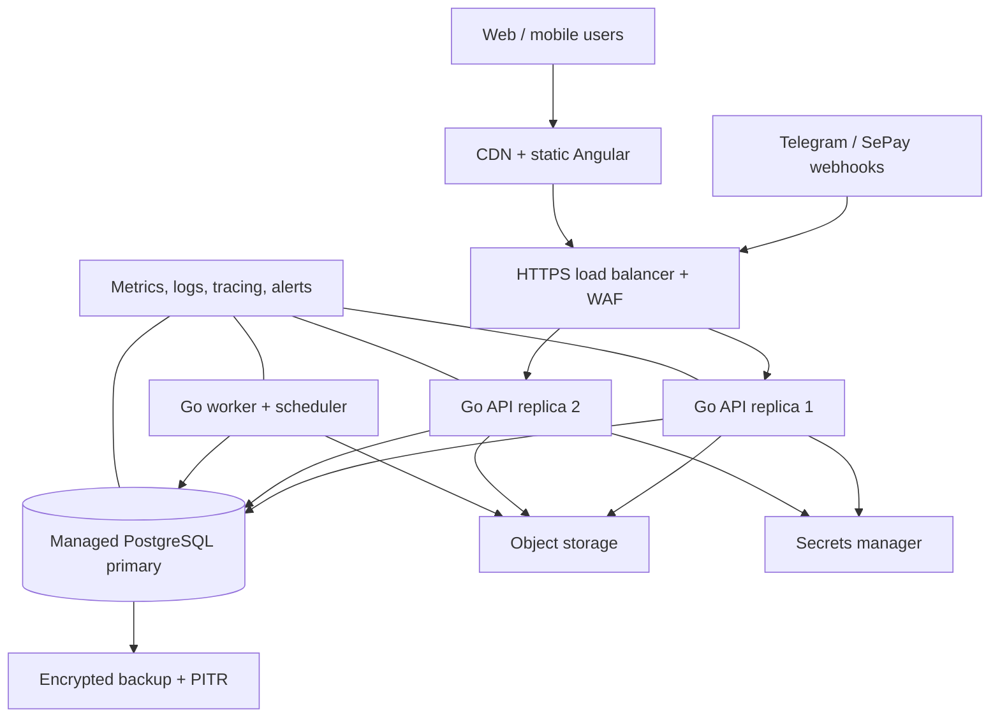
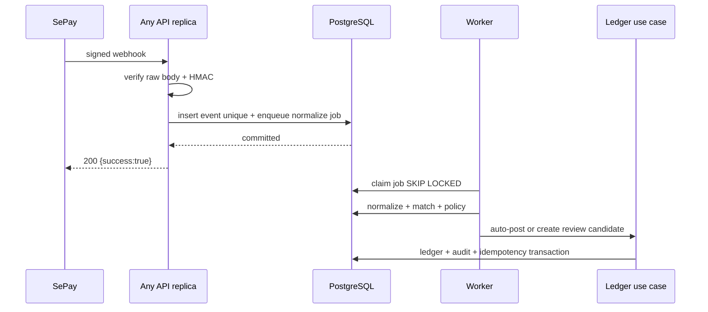

# Kiến trúc WealthOS cho 100 người dùng

## Quyết định

Mục tiêu là vận hành ổn định cho **100 người dùng đã đăng ký, 20 người đồng thời và burst 20 request/giây**, bao gồm burst webhook từ SePay. Đây là quy mô nhỏ đối với Go và PostgreSQL; rủi ro chính không phải CPU mà là sai sổ cái, webhook xử lý lặp, job bị kẹt và backup không khôi phục được.

Chọn **modular monolith + PostgreSQL + durable job queue trong PostgreSQL**, triển khai hai API replica và một worker. Không dùng microservice, Kubernetes, Kafka hay Elasticsearch ở giai đoạn này. Thiết kế này giảm đáng kể chi phí vận hành nhưng vẫn scale ngang API/worker khi số người dùng tăng.

Con số trên là mục tiêu kiểm thử, không phải cam kết tuyệt đối; phải được xác nhận bằng load test và theo dõi production trước khi mở rộng.

## Giả định tải để thiết kế

| Loại tải | Ngưỡng thiết kế |
|---|---:|
| Người dùng đã đăng ký | 100 |
| Người dùng hoạt động đồng thời | 20 |
| API interactive burst | 20 request/giây trong 5 phút |
| Webhook bank-feed burst | 20 event/giây trong 5 phút |
| Giao dịch ngân hàng/ngày | 2.000 event |
| Dashboard/net-worth read | 5 request/giây sustained |
| Job nặng | Snapshot, forecast, export, backfill chạy bất đồng bộ |

20 request/giây tương đương 1,7 triệu request/ngày nếu kéo dài liên tục, cao hơn rất nhiều so với hành vi thực của 100 người dùng. Mục đích là có headroom cho import, retry và webhook, không phải tối ưu theo số trung bình.

## Sơ đồ triển khai



### Các thành phần bắt buộc

| Thành phần | Số lượng ban đầu | Trách nhiệm |
|---|---:|---|
| Angular static site | CDN/object storage | Không giữ secret; cache asset dài hạn |
| HTTPS load balancer/WAF | 1 managed service | TLS, request size limit, rate limit, routing `/webhooks/*` |
| Go API | 2 replica stateless | Auth/RBAC, ledger, read API, webhook ingress, tạo job trong cùng DB transaction |
| Go worker | 1 replica | Bank-feed normalize/classify, snapshot, recurring, export, notification, reconciliation |
| PostgreSQL managed | 1 primary, PITR | Source of truth, queue bền vững, audit, idempotency, migration |
| Object storage | 1 bucket logical | Attachment/export, encryption, signed URL, lifecycle |
| Secrets manager | 1 managed service | JWT keys, SePay/Hermes secret, DB credential rotation |
| Observability | 1 stack managed/self-hosted | Metrics, structured logs, trace ID, alert |

Không cần Redis trong bản đầu. PostgreSQL đủ để làm transaction, idempotency và durable queue ở tải này. Chỉ thêm Redis khi metric cho thấy cache/rate-limit hoặc job throughput là bottleneck; Redis không được giữ dữ liệu sổ cái duy nhất.

## Ranh giới module trong Go monolith

```text
cmd/api       HTTP handlers, auth middleware, webhook ingress, readiness
cmd/worker    job runner, scheduler, retry executor
internal/
  identity    users, user, RBAC, session
  ledger      accounts, transactions, transfers, idempotency
  portfolio   loans, assets, valuations, net worth, snapshots
  bankfeed    SePay adapters, raw events, classify, reconcile, automation rules
  planning    budgets, recurring rules, forecast
  assistant   Telegram gateway, commands, Hermes adapter
  platform    PostgreSQL, outbox/jobs, encryption, object storage, observability
```

Module chỉ giao tiếp qua interface/use case trong process và transaction DB rõ ràng. `bankfeed` không được ghi bảng ledger bằng SQL trực tiếp; nó gọi use case của `ledger`. Đây là rào chắn quan trọng để auto-post từ SePay vẫn giữ toàn bộ invariant tài chính.

## Dữ liệu, queue và tính đúng

### PostgreSQL là source of truth

- Mọi thay đổi ledger, audit log và bản ghi job/outbox được commit trong **một DB transaction**.
- `bank_feed_events(provider, external_event_id)` và `bank_feed_transactions(connection_id, provider_transaction_id)` có unique constraint. Retry/replay chỉ đọc lại kết quả cũ.
- Worker lấy job bằng `FOR UPDATE SKIP LOCKED`; có `attempt`, `run_at`, backoff, dead-letter state và correlation ID.
- API/webhook chỉ validate + durable insert/enqueue rồi trả; không chờ forecast, OCR, classify nặng hoặc export.
- Snapshot là cache rebuildable. Không dùng cache làm nguồn net worth hoặc ledger.

### Luồng webhook SePay chịu burst



Nếu worker chết sau ACK, job vẫn ở PostgreSQL và được retry. Nếu event đến hai lần, unique key bảo đảm chỉ có một import/ledger result. Nếu PostgreSQL không commit được, API trả lỗi để SePay retry; không “ack cho xong” khi chưa lưu bền vững.

## Sizing production ban đầu

| Dịch vụ | Cấu hình khởi đầu | Khi nào tăng |
|---|---|---|
| API | 2 × 1 vCPU, 1–2 GB RAM | p95 API > 400 ms, CPU > 65% 15 phút, hoặc cần HA khi deploy |
| Worker | 1 × 1 vCPU, 1–2 GB RAM; concurrency 4 | Queue lag > 60 s hoặc CPU > 65% 15 phút |
| PostgreSQL | 2 vCPU, 8 GB RAM, SSD managed, 20–50 connection pool | DB CPU > 60%, p95 query > 100 ms, pool wait hoặc growth storage > 70% |
| Connection pool | 20 app connections/replica; 10 worker | DB connection wait/pool exhaustion; ưu tiên tối ưu query trước tăng connection |
| Object storage | Lifecycle 30–90 ngày cho export tạm | Có attachment/export lớn hoặc retrieval chậm |

Số replica API giữ dịch vụ online khi deploy/1 process hỏng. Một worker là đủ cho tải này, nhưng job phải có lease và retry để khi restart không bị mất. Nếu cần availability cao hơn, chạy worker thứ hai dùng cùng `SKIP LOCKED`; scheduler job định kỳ cần advisory lock để không chạy hai lần.

## Độ tin cậy, bảo mật và khôi phục

### Mục tiêu vận hành

| Mục tiêu | Ngưỡng |
|---|---|
| API read/write p95 | < 400 ms, không tính export/forecast async |
| Webhook accepted | < 2 giây sau durable commit |
| Queue lag bank-feed | < 60 giây bình thường; alert > 5 phút |
| RPO | ≤ 15 phút với PITR + backup định kỳ |
| RTO | ≤ 4 giờ qua runbook restore đã diễn tập |

### Bắt buộc

- Multi-AZ/PITR cho PostgreSQL nếu đã có dữ liệu thật; backup daily không thay PITR.
- Restore drill mỗi quý: khôi phục vào môi trường tách biệt, chạy migration compatible và rebuild snapshot đối chiếu ledger.
- API/worker chạy non-root, secret chỉ runtime injection; quyền DB tách migration role và app role khi khả thi.
- Rate-limit login và `/webhooks/sepay`; HMAC/raw-body luôn là control chính cho webhook.
- Structured log không có token, số tài khoản đầy đủ hoặc raw bank content; trace ID nối request, job, audit và provider event.
- Deploy rolling: migration tương thích ngược trước, API mới sau; feature flag cho SePay auto-post để có thể tắt tức thời mà không làm mất ingest.

## Dashboard và truy vấn

Không tính net worth bằng cách quét toàn bộ ledger cho mọi request. API trả dashboard từ `portfolio_snapshots` theo `as_of`, rồi drill-down query có index. Khi transaction/valuation thay đổi, ghi job rebuild snapshot; UI có thể hiện `calculatedAt` nếu job chưa hoàn tất.

Các index tối thiểu: `(user_id, occurred_at DESC)` trên transaction, `(account_id, occurred_at DESC)`, unique provider event/import, `(loan_id, due_at)`, `(portfolio_id, snapshot_date DESC)`. Query plan phải được kiểm tra bằng `EXPLAIN ANALYZE` trên fixture có ít nhất 10 lần dữ liệu dự kiến của 100 người dùng.

## Kế hoạch kiểm thử trước khi mở user thật

1. Unit test ledger invariant, idempotency và classifier priority.
2. Integration test PostgreSQL thật: 100 webhook trùng song song chỉ tạo một ledger entry.
3. Load test: 20 API request/giây + 20 webhook/giây trong 5 phút, theo dõi p95, error rate, queue lag và DB pool wait.
4. Failure test: restart worker/API giữa job; simulate SePay retry/replay; không mất hoặc double-post event.
5. Restore drill: restore point-in-time vào DB mới, chạy audit/rebuild snapshot; xác nhận net worth tái tạo được.
6. Canary: bật SePay auto-post cho 1 user nội bộ trước; theo dõi reclassify rate rồi mới mở rộng.

## Ngưỡng mở rộng có chủ đích

| Tín hiệu | Hành động tiếp theo |
|---|---|
| Worker lag kéo dài nhưng DB khỏe | Tăng worker replica/concurrency; tối ưu batch và lock |
| API CPU/p95 cao, DB khỏe | Tăng API replica; cache response read-only ngắn hạn nếu cần |
| DB query/pool chậm | Thêm index, sửa query/N+1, archive raw payload; chưa thêm read replica ngay |
| Dashboard read chiếm đa số | Materialize snapshot/summary tốt hơn; chỉ sau đó mới cân nhắc read replica |
| >1.000 active users hoặc nhiều provider | Tách `bankfeed` worker/service qua outbox contract; PostgreSQL ledger vẫn là source of truth |
| Tìm kiếm full-text trên attachment lớn | Thêm search service độc lập, không đẩy truy vấn đó vào primary DB |

## Không làm ở mốc 100 người dùng

- Kubernetes/service mesh hoặc autoscaling phức tạp.
- Kafka/RabbitMQ chỉ để xử lý vài chục event/giây.
- Microservice tách từng domain và distributed transaction.
- Read replica chỉ vì “có vẻ scale”; snapshot/index thường giải quyết được trước.
- AI classifier chạy đồng bộ trong webhook path.

Chi tiết thành phần triển khai hiện có nằm tại [09-deployment.md](09-deployment.md); contract SePay nằm tại [17-sepay-bank-integration.md](17-sepay-bank-integration.md).
